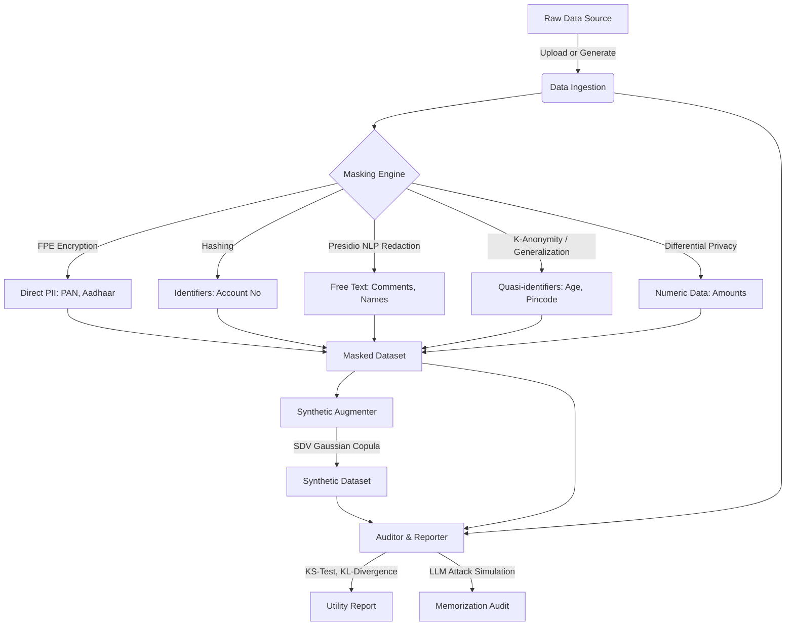
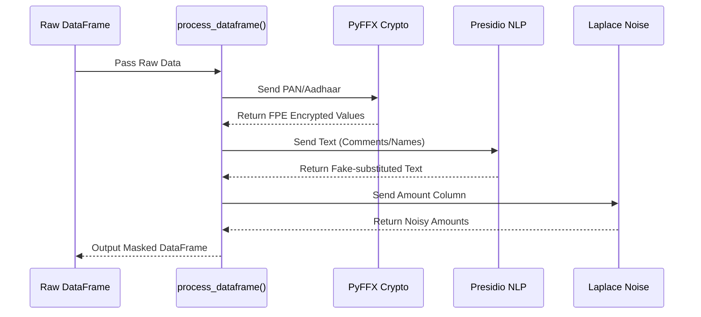

# Blostem Privacy Pipeline: Architecture & Design Document

This document describes the inner workings of the Enterprise-Grade Data Masking Pipeline. It covers both the High-Level Design (HLD) of the overall system and the Low-Level Design (LLD) of its core components.

---

## 1. High-Level Design (HLD)

The Blostem Privacy Pipeline is an end-to-end data processing system designed to take sensitive raw financial data and securely anonymize it for uses such as analytics and in-house LLM training.

### 1.1 Core Architecture Components

- **Frontend (Streamlit UI):** Provides a visual dashboard (`app.py`) for data ingestion, pipeline execution, and result visualization.
- **Data Ingestion Module:** Accepts CSV uploads or generates realistic synthetic "raw" fintech data.
- **Masking Engine:** The core processor that applies varying privacy techniques based on the data type (Encryption, Redaction, Generalization, Differential Privacy).
- **Synthetic Data Augmenter:** Learns the statistical properties of the masked data and generates a "digital twin" dataset that contains no real records but maintains the statistical distribution.
- **Reporting & Auditing Module:** Analyzes the trade-off between privacy and utility, and simulates prompt-injection attacks to verify safety.

### 1.2 System Workflow Diagram

---

## 2. Low-Level Design (LLD)

### 2.1 `masking_engine.py` (The Privacy Processor)

The masking engine routes different columns through specific privacy mechanisms.

#### Component Breakdown:

1. **Format-Preserving Encryption (FPE) via `pyffx`:**
   - **Target:** `PAN_Number`, `Aadhaar_Number`.
   - **Mechanism:** Uses a secret key (`blostem-secret-key`) to reversibly encrypt data while maintaining its format (e.g., 10-character alphanumeric PAN stays 10-character alphanumeric).
   - **Functions:** `fpe_encrypt_pan(pan)`, `fpe_encrypt_aadhaar(aadhaar)`.

2. **Microsoft Presidio (NLP Text Masking):**
   - **Target:** `Name`, `Phone_Number`, `Email`, `Comments`.
   - **Mechanism:** `AnalyzerEngine` scans text using regex (custom rules for Indian PAN/Aadhaar) and NER to detect entities. `AnonymizerEngine` replaces detected entities using Faker to swap them with realistic but fake values.
   - **Functions:** `mask_text(text)`.

3. **Generalization (k-Anonymity):**
   - **Target:** `Age`, `Pincode`.
   - **Mechanism:** Reduces the granularity of data to group users together.
   - **Functions:** `generalize_age(age)` -> Buckets like "18-25", "26-35". `generalize_pincode(pincode)` -> Masks last 3 digits "400XXX".

4. **Differential Privacy (DP):**
   - **Target:** `Amount`.
   - **Mechanism:** Injects Laplacian Noise based on a privacy budget (ε = 1.0) and sensitivity. This ensures individual transaction amounts cannot be reverse-engineered while aggregate sums remain statistically accurate.
   - **Functions:** `add_laplace_noise(series, epsilon, sensitivity)`.

### 2.2 `synthetic_augmenter.py` (Data Synthesizer)

- **Library:** `sdv` (Synthetic Data Vault).
- **Model:** `GaussianCopulaSynthesizer`.
- **Flow:** Takes the *masked data* as input, detects column metadata and distributions, trains a statistical model, and samples new rows. This generates a purely mathematical dataset (Synthetic Twins) representing the same business realities with 0% risk of 1:1 mapping to real users.

### 2.3 `report_generator.py` (Utility Metric Calculator)

- Measures how much utility was lost during masking.
- **Metrics Calculated:**
  - **Text Changes:** Percentage of PII strings modified.
  - **Numeric Utility:** Compares `Raw Amount` vs `Masked Amount (with DP noise)`.
  - **Algorithms:**
    - **KS-Statistic (Kolmogorov-Smirnov):** Measures distance between empirical distributions.
    - **KL-Divergence (Kullback-Leibler):** Measures how much information is lost when the masked distribution is used to approximate the raw distribution.

### 2.4 `auditor.py` (Memorization Auditor)

- **Purpose:** Proves the pipeline works by simulating an "Extraction Attack" often seen in LLMs trained on sensitive data.
- **Mechanism:**
  1. Picks a random user from the Raw Data.
  2. "Asks" the mock LLM for their PAN number.
  3. Proves that if trained on Raw Data, the PAN leaks.
  4. Proves that if trained on Masked Data, the PAN is redacted or encrypted.
  5. Proves that if trained on Synthetic Data, the record doesn't exist at all.

---

## 3. Data Flow and State Management

State is maintained globally in the Streamlit runtime (`st.session_state`):
1. `st.session_state.raw_data`: The initial ingestion point.
2. `st.session_state.masked_data`: Result of `masking_engine.py`.
3. `st.session_state.synthetic_data`: Result of `synthetic_augmenter.py`.
4. `st.session_state.report`: The evaluation payload from `report_generator.py`.

This state flows through the 4 tabs of the Streamlit dashboard (`app.py`), gating execution so that users must sequentially generate raw data -> mask it -> synthesize it.
