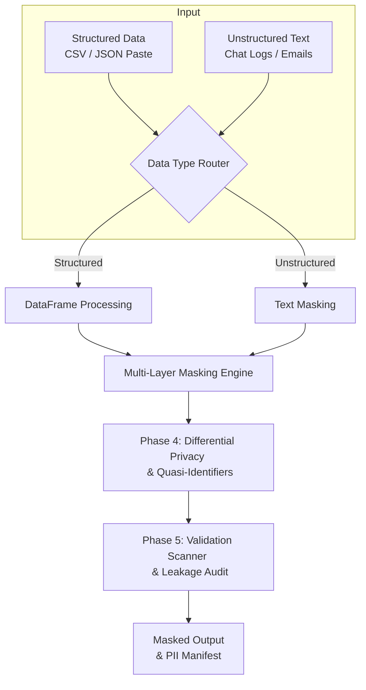
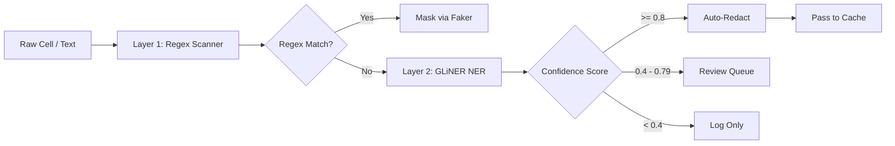
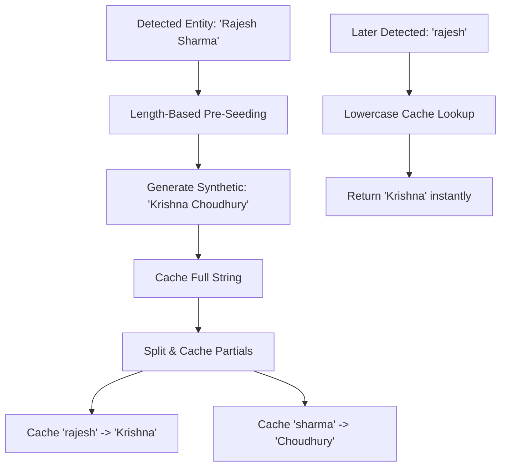
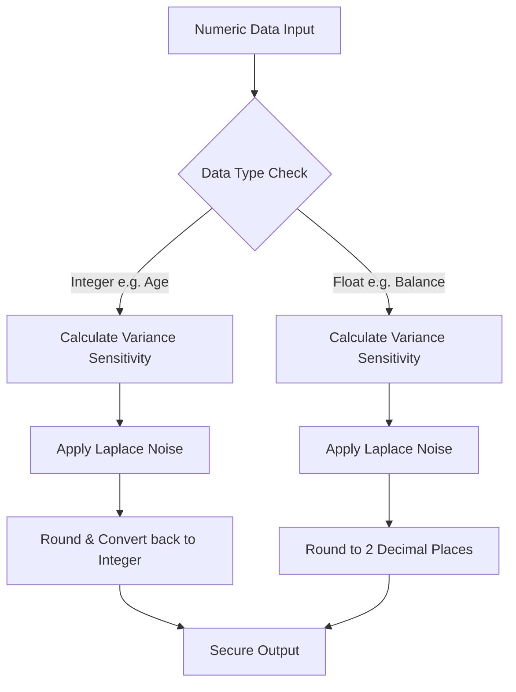

# 🛡️ Blostem Data Masking Pipeline v4

Enterprise-grade, DPDP-compliant multi-layer PII detection and masking pipeline tailored for Indian fintech data.

## 🌟 Key Features

1. **Multi-Layer Architecture**:
   - **Layer 1 (Regex + Intelligent Discovery)**: Deterministic matching for structured PII. Includes **Luhn Algorithm Validation** for Credit Cards to prevent false positives.
   - **Layer 2 (GLiNER NER)**: Context-aware zero-shot detection for unstructured text.
   - **Layer 3 (Validation)**: Recursive re-scanning to guarantee zero leakage.

2. **Semantic Transformation (Digital Twin)**:
   - **Synthetic Substitution**: Irreversible Faker-based substitution that preserves natural language flow for LLM fine-tuning.
   - **Referential Integrity**: Deterministic caching ensures `Rajesh` always maps to `Krishna` across the entire session.

3. **Advanced Utility Metrics (Market Standard 2026)**:
   - **Jensen-Shannon Divergence**: Symmetric distribution similarity check for numeric data.
   - **Semantic Utility Score**: Word-overlap analysis (Jaccard) to ensure the model learns "human-speak," not "redacted-speak."

4. **Differential Privacy & Dynamic Type Inference**:
   - **Laplace Noise (ε=1.0)**: Protects numeric values while maintaining statistical shape.
   - **Smart Type Preservation**: Detects Integers vs Floats to prevent "19.21 year old" artifacts.

4. **Content-First, Schema-Agnostic Processing**:
   - The pipeline does not blindly trust column headers. Irrelevant column names (like `col_4`) are automatically analyzed based on their content. If they contain pure numbers, they receive Differential Privacy. If they contain text, they are scanned by Regex and GLiNER to uncover hidden PII.

4. **Quasi-Identifier Protection (LLM-Optimized)**:
   - `Age` is protected using Differential Privacy (Laplace noise) rounded to the nearest integer. This maintains perfect natural age distributions instead of clunky text bands.
   - `Pincode` is fully substituted with completely valid synthetic Indian Pincodes using the deterministic session cache, ensuring LLM fine-tuning datasets look 100% natural.

5. **Confidence-Based Routing**:
   - High confidence (>0.8) → Auto-redact.
   - Medium confidence (0.4-0.8) → Mask and flag for review.
   - Low confidence (<0.4) → Log only for audit.

6. **Real-time Leakage Auditor & Attack Simulator**:
   - Ground-truth evaluation cross-checking raw PII against masked output.
   - Simulates targeted LLM memorization attacks to prove privacy.

---

## 📂 Architecture & Workflows

### 1. Complete System Overview
This diagram shows the high-level flow of data from ingestion to final secure output.



### 2. Inner Workings: Multi-Layer Detection Engine
How the pipeline actually detects and decides what to do with PII.



### 3. Inner Workings: Referential Integrity & Caching
How the system handles complex edge cases like case-sensitivity and partial name matches without losing context.



### 4. Inner Workings: Differential Privacy & Dynamic Type Inference
How the system protects numbers (like Balances and Ages) while smartly maintaining their original data types (Floats vs Integers) to avoid unrealistic data (like a 19.21 year old).



---

## 🚀 Setup Instructions

### Prerequisites
- Python 3.9+
- Virtual Environment

### Installation

```bash
# 1. Create and activate virtual environment
python -m venv venv
source venv/bin/activate  # On Mac/Linux
# venv\Scripts\activate   # On Windows

# 2. Install dependencies
pip install -r requirements.txt

# 3. (Optional) Download GLiNER Model for NER
# Without this, the pipeline gracefully falls back to Regex + Column-based rules.
```

## 🎮 Running the Dashboard

```bash
streamlit run app.py
```

### Demo Guide

1. **Ingest Data**: 
   - **Upload** a raw CSV file.
   - **Paste** raw JSON/CSV directly into the new sidebar text area (e.g. `{"Name": "Rajesh", "Amount": 5000}`).
   - **Generate** a sample synthetic dataset.
2. **Toggle NER**: Check "Enable GLiNER NER" to use the ML model (requires download on first run) or leave unchecked for Regex-only + fallback mode.
3. **Select Model**: Choose between `urchade/gliner_multi_pii-v1` (multilingual) or `nvidia/gliner-PII` (optimized for English PII).
4. **Run Pipeline**: Click "Run Masking Pipeline".
5. **Explore Tabs**:
   - **Tab 1: Raw Data**: See the generated sensitive data.
   - **Tab 2: Masked Data**: Export as CSV, JSONL, Parquet, or JSON Manifest. Observe Differential Privacy in numeric columns!
   - **Tab 3: PII Manifest**: View detection charts, validation passes, and breakdown by severity.
   - **Tab 4: Utility Report**: Compare raw vs. masked distribution using Kernel Density Estimation (KDE).
   - **Tab 5: Leakage Audit**: Run the "Targeted Attack Simulation" to prove that PII is unrecoverable.
   - **Tab 6: Text Masking**: Paste free-text logs and see unstructured PII masked in real-time.

## 🧠 Technical Design Decisions: Why GLiNER?

For Layer 2 (Contextual NER), we chose **GLiNER** over Generative Small Language Models (SLMs) like Microsoft Phi or Google Gemma for four strategic reasons:

1. **Exact Precision**: GLiNER is an *encoder-based* model that provides exact character-level offsets (start/end indices) for every entity. Generative SLMs often output JSON or natural language, making it difficult to map detections back to the original text without alignment errors.
2. **Deterministic Extraction**: Unlike generative models, GLiNER does not "hallucinate" or rewrite the text. It strictly classifies existing tokens, ensuring the substitution engine has the exact original value to cache.
3. **Extreme Efficiency**: At ~300M parameters, GLiNER is **10x smaller and faster** than the smallest generative SLMs (which start at 2B-3B parameters). This allows for high-throughput log processing on standard CPUs without requiring expensive GPUs.
4. **Zero-Shot Flexibility**: It allows us to define any custom PII label (e.g., `bank_account`) in `pii_config.yaml` and detect it instantly without fine-tuning, which is significantly more difficult and expensive with prompt-based SLMs.

## ⚙️ Configuration
Add or modify regex patterns, GLiNER labels, and routing thresholds in `config/pii_config.yaml` without changing core Python code.
