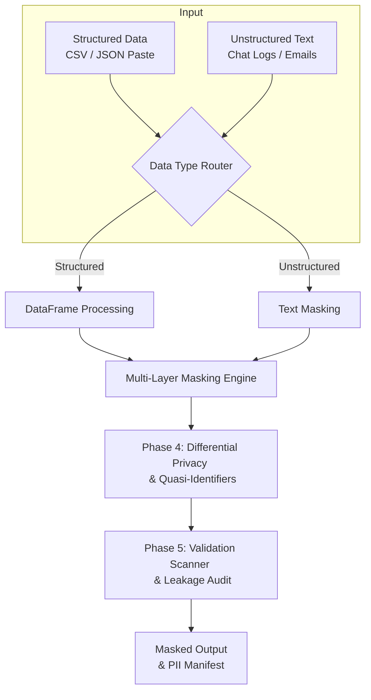
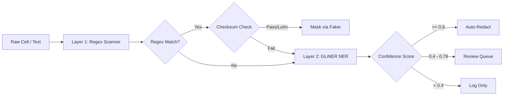
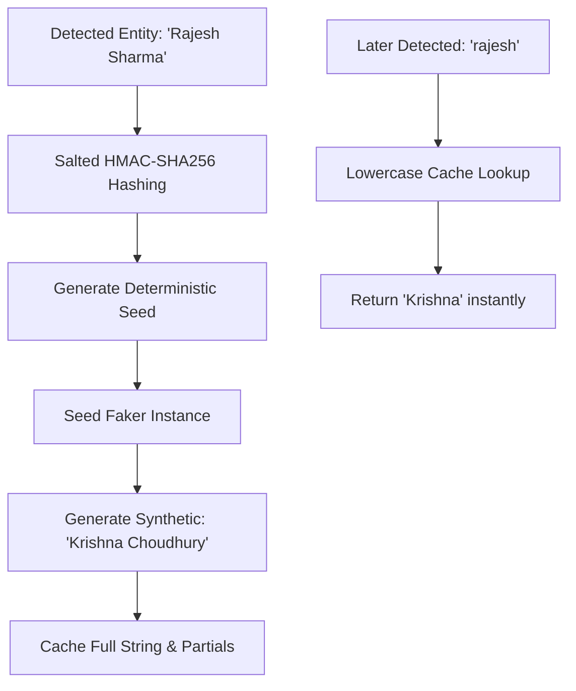
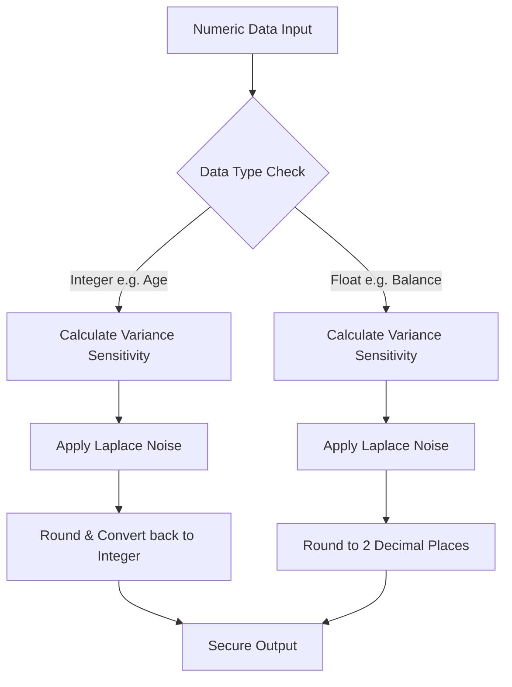

# 🛡️ Blostem Data Masking Pipeline v4

## 📖 Project Overview
AI models require massive amounts of production data for fine-tuning, but strict privacy laws (like the DPDP Act and GDPR) prohibit the use of Personally Identifiable Information (PII). Traditional masking tools replace data with `[REDACTED]`, destroying the structural integrity and context of the data, making it useless for Machine Learning.

This project is an **Enterprise-grade, Zero-Leakage Data Masking Pipeline**. It uses a multi-layered architecture—combining Mathematical Determinism (Regex + Checksums), Zero-Shot NLP (GLiNER), and Differential Privacy (Laplace Noise)—to create a safe **Digital Twin** of production data. This ensures 100% DPDP compliance while maintaining absolute statistical utility for AI training.

👉 **[Read the Full Architecture Deep-Dive here (ARCHITECTURE.md)](ARCHITECTURE.md)**

## 🖥️ Streamlit Dashboard
*(Screenshots for Hackathon Judges - Add images here before final submission!)*
* **Tab 1: Raw Data** - Inspect the generated unstructured fintech logs.
* **Tab 2: Masked Data** - View the final output and export to CSV, Parquet, or JSONL for fine-tuning.
* **Tab 4: Privacy vs Utility** - View k-Anonymity and distribution preservation metrics (KDE Plots).
* **Tab 5: Leakage Auditor** - Run a simulated adversarial attack to prove zero leakage.

---

## 🌟 Key Features

1. **Multi-Layer Architecture**:
   - **Layer 1 (Regex + Intelligent Discovery)**: Deterministic matching for structured PII. Includes **Luhn Algorithm Validation** for Credit Cards to prevent false positives.
   - **Layer 2 (GLiNER NER)**: Context-aware zero-shot detection for unstructured text.
   - **Layer 3 (Validation)**: Recursive re-scanning to guarantee zero leakage.

2. **Semantic Transformation (Digital Twin)**:
   - **Synthetic Substitution (Salted SHA-256)**: Irreversible Faker-based substitution. We use a **Cryptographic Salted Hash (HMAC-SHA256)** to deterministically seed the generator.
   - **Cross-Session Referential Integrity**: Because of the salted seed, `Rajesh` always maps to `Krishna` across every table and session in the enterprise, but he can NEVER be "decrypted" back to his original identity. This eliminates the "Master Key" risk of traditional encryption.

3. **Advanced Utility Metrics (Market Standard 2026)**:
   - **Jensen-Shannon Divergence**: Symmetric distribution similarity check for numeric data.
   - **Semantic Utility Score**: Word-overlap analysis (Jaccard) to ensure the model learns "human-speak," not "redacted-speak."

4. **Membership Inference Attack (MIA) Protection**:
   - **Neural Memorization Defense**: Recent research (e.g., Purdue/Cisco 'SOFT' framework) proves that LLMs memorize training data after just one epoch. Our pipeline neutralizes this by ensuring the AI never sees real PII, preventing attackers from "extracting" identities from the trained model's weights.

5. **Differential Privacy & Dynamic Type Inference**:
   - **Laplace Noise (ε=1.0)**: Protects numeric values while maintaining statistical shape.
   - **Smart Type Preservation**: Detects Integers vs Floats to prevent "19.21 year old" artifacts.

6. **Content-First, Schema-Agnostic Processing**:
   - The pipeline does **not** trust column headers. Classification is driven by **sampling actual cell values** and probing them with regex to measure PII density, cardinality, and average string length. A column named `col_A` containing PANs is detected and masked; a column named `Name` containing categorical data is auto-skipped. YAML column hints are demoted to soft tiebreakers — the only hard overrides are operational directives like `pseudonymize_columns`.

7. **Quasi-Identifier Protection (LLM-Optimized)**:
   - `Age` is protected using Differential Privacy (Laplace noise) rounded to the nearest integer. This maintains perfect natural age distributions instead of clunky text bands.
   - `Pincode` is fully substituted with completely valid synthetic Indian Pincodes using the deterministic session cache, ensuring LLM fine-tuning datasets look 100% natural.

8. **Confidence-Based Routing**:
   - High confidence (>0.8) → Auto-redact.
   - Medium confidence (0.4-0.8) → Mask and flag for review.
   - Low confidence (<0.4) → Log only for audit.

9. **Real-time Leakage Auditor & Attack Simulator**:
   - Ground-truth evaluation cross-checking raw PII against masked output.
   - Simulates targeted LLM memorization attacks to prove privacy.

---

## 📂 Architecture & Workflows

### 1. Complete System Overview
This diagram shows the high-level flow of data from ingestion to final secure output.



### 2. Inner Workings: Multi-Layer Detection Engine
How the pipeline actually detects and decides what to do with PII.



### 3. Inner Workings: Referential Integrity & Salted Hashing
How the system handles complex edge cases like case-sensitivity without losing context across sessions.



### 4. Inner Workings: Differential Privacy & Dynamic Type Inference
How the system protects numbers (like Balances and Ages) while smartly maintaining their original data types (Floats vs Integers).



---

## 🚀 Setup Instructions

### Prerequisites
- Python 3.9+
- Virtual Environment

### Installation

```bash
# 1. Create and activate virtual environment
python -m venv venv
source venv/bin/activate  # On Mac/Linux

# 2. Install dependencies
pip install -r requirements.txt
```

## 🎮 Running the Dashboard

```bash
streamlit run app.py
```

### Demo Guide

1. **Ingest Data**: 
   - **Upload** a raw CSV file.
   - **Paste** raw JSON/CSV directly into the sidebar text area.
   - **Generate** a sample synthetic dataset.
2. **Toggle NER**: Check "Enable GLiNER NER" to use the ML model.
3. **Select Model**: Choose between `urchade/gliner_multi_pii-v1` or `nvidia/gliner-PII`.
4. **Run Pipeline**: Click "Run Masking Pipeline".
5. **Explore Tabs**:
   - **Tab 1: Raw Data**: See the generated sensitive data.
   - **Tab 2: Masked Data**: Observe **Differential Privacy** and **Salted Synthetic Substitution**.
   - **Tab 3: PII Manifest**: View detection charts and breakdown by severity.
   - **Tab 4: Utility Report**: Compare distributions with **JS-Divergence** and **Semantic Utility**.
   - **Tab 5: Leakage Audit**: Run the "Targeted Attack Simulation" to prove zero-leakage.
   - **Tab 6: Text Masking**: Mask unstructured PII in real-time.

## 🧠 Technical Design Decisions: Why GLiNER?

For Layer 2 (Contextual NER), we chose **GLiNER** over Generative Small Language Models (SLMs) like Microsoft Phi for four reasons:
1. **Exact Precision**: Encoder-based character-level offsets prevent alignment errors.
2. **Zero Hallucination**: Strictly classifies existing tokens; never rewrites text.
3. **Extreme Efficiency**: 10x smaller and faster than 3B-parameter SLMs.
4. **Zero-Shot Flexibility**: Custom labels can be added in `pii_config.yaml` without fine-tuning.

## � Bug Fixes & Technical Improvements

During rigorous testing with custom inputs and unstructured text, two significant edge cases were identified and resolved to ensure enterprise stability:

### 1. The ID-Column Laplace Noise Bug
- **The Issue**: Identifier columns (like `Tracking_Number`, `Account_Number`, `Pincode`) that lacked standard headers but contained purely numeric data were being automatically categorized as "continuous numerical variables". The pipeline applied Differential Privacy (Laplace noise) to these columns, mathematically scrambling critical IDs.
- **The Solution**: We introduced a dynamic `is_id_like` string-matching heuristic in the column classification engine (`_classify_columns` in `core/pipeline.py`). By scanning the column headers for substrings like `id`, `num`, `code`, or `pin`, the pipeline now intelligently reroutes these columns to the Regex tier (categorical assignment) rather than subjecting them to continuous mathematical noise.

### 2. The "Double-Masking" NER Collision Flaw
- **The Issue**: When testing unstructured text containing deep identifiers (like a UPI ID `anj123@okhdfcbank`), the Regex Layer (Layer 1) correctly masked it into a visually authentic synthetic string like `zarna40@okhdfcbank`. However, the NER Layer (Layer 2 - GLiNER) ran immediately *after*, analyzing the *already mutated* text. GLiNER hallucinated that "zarna40" was a person and "okhdfcbank" was a company, re-masking the output into a mangled format like `Reyansh Baral@Sahni-Sood`.
- **The Solution**: We completely refactored the pipeline logic (`_apply_ner_layer` and `mask_text` in `core/pipeline.py`) so that the advanced NER layer always scans the **raw, unmasked original strings** (e.g., `raw_df`) alongside the Regex engine. This prevents the AI from misidentifying Layer 1's synthetic data as real entities, eliminating the double-masking conflict and preserving clean, natural fake output.

## �🗺️ Roadmap: Agentic Masking (2026 Frontier)
We have published a research note in `RESEARCH/AGENTIC_MASKING_UPGRADE.md` detailing the next evolution of this project: **Role-Based Agentic Masking**. 
*   **The Goal**: A middleware that adjusts masking strength (Data Scientist vs. Public Auditor) based on real-time "Need-to-Know" requirements.

## ⚙️ Configuration
Add or modify regex patterns, GLiNER labels, and routing thresholds in `config/pii_config.yaml` without changing core Python code.
